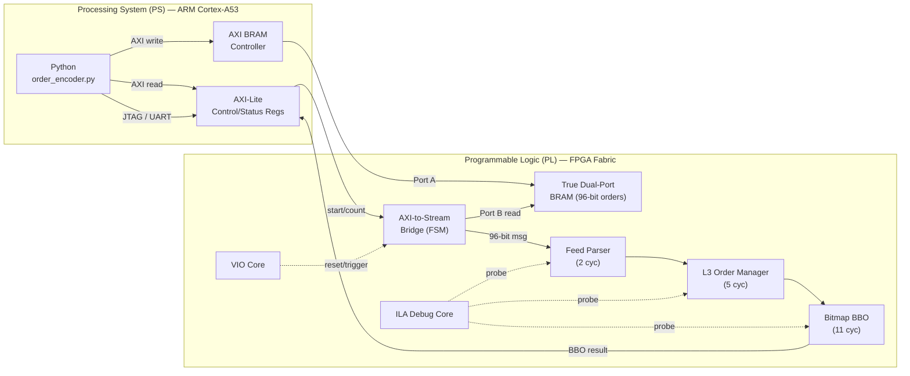

# L3 Order Book — ZCU102 FPGA Implementation Guide

> **Board:** AMD Zynq UltraScale+™ MPSoC ZCU102 (XCZU9EG-2FFVB1156)  
> **Clock:** 250 MHz PL clock from PS  
> **Tools:** Vivado 2024.x, Vitis 2024.x (or PetaLinux)

---

## Architecture Overview



**Data Flow:**
1. Python encodes orders → writes to shared BRAM via AXI
2. Python writes `start` + `order_count` to AXI-Lite control registers
3. PL bridge FSM reads orders from BRAM, feeds them to `feed_parser` one per clock
4. L3 pipeline processes orders, bitmap produces BBO
5. BBO results are written to AXI-Lite status registers, readable by Python
6. ILA captures waveforms for debug; VIO provides manual reset/trigger

---

## Phase 1: Vivado Project Creation

### Step 1.1 — Create New Project

1. Open **Vivado 2024.x**
2. **File → Project → New**
3. Project name: `l3_order_book_zcu102`
4. Project type: **RTL Project** (check "Do not specify sources at this time")
5. **Default Part** → click **Boards** tab → search `ZCU102` → select **ZCU102 Evaluation Board**
6. Click **Finish**

### Step 1.2 — Add RTL Source Files

1. In **Sources** panel → right-click **Design Sources** → **Add Sources** → **Add or Create Design Sources**
2. Add these files from your project folder:
   - `bitmap.v`
   - `feed_parser.v`
   - `l3_order_manager.v`
   - `l3_order_book_top.v`
3. Click **Finish**

> [!NOTE]
> Do NOT add testbench files (`tb_l3.v`, `tb.v`) to design sources. Only add them to simulation sources if you want to run behavioral sim in Vivado.

---

## Phase 2: Block Design

### Step 2.1 — Create Block Design

1. In the **Flow Navigator** (left panel) → click **Create Block Design**
2. Design name: `system_bd`
3. Click **OK**

### Step 2.2 — Add Zynq UltraScale+ PS

1. In the block design canvas, click **+ (Add IP)**
2. Search for **Zynq UltraScale+ MPSoC** → double-click to add
3. Click the green banner **Run Block Automation** → accept defaults → **OK**
   - This applies the ZCU102 board presets (DDR4, UART, etc.)

### Step 2.3 — Configure PS Clocks

1. Double-click the **Zynq UltraScale+ MPSoC** block
2. Go to **Clock Configuration → Output Clocks → Low Power Domain → PL Fabric Clocks**
3. Enable **PL0** and set frequency to **250 MHz**
4. Click **OK**

### Step 2.4 — Add AXI BRAM Controller (Order Input BRAM)

This BRAM stores orders written by Python, read by PL.

1. Click **+ (Add IP)** → search **AXI BRAM Controller** → add it
2. Double-click the AXI BRAM Controller:
   - **Number of BRAM Interfaces**: `1`
   - **Data Width**: `32` (AXI is 32-bit; we'll pack 96-bit orders across 3 words)
   - **Address Width**: Keep at 32 (auto-computed)
3. Click **+ (Add IP)** → search **Block Memory Generator** → add it
4. Double-click the Block Memory Generator:
   - **Memory Type**: `True Dual Port RAM`
   - **Port A Options**: Width = `32`, Depth = `4096` (enough for 1365 orders × 3 words each)
   - **Port B Options**: Width = `32`, Depth = `4096`, Enable Port B = checked
   - **Click OK**
5. Connect:
   - AXI BRAM Controller `BRAM_PORTA` → Block Memory Generator `BRAM_PORTA`
   - Port B will be our custom RTL read port (leave unconnected for now)

### Step 2.5 — Add AXI GPIO (Control/Status Registers)

We'll use 2 AXI GPIOs: one for control (PS→PL), one for status (PL→PS).

**Control GPIO (PS writes):**
1. Click **+ (Add IP)** → **AXI GPIO** → add it, rename to `gpio_control`
2. Double-click:
   - **Channel 1**: Width = `32`, Direction = **All Output**, Default value = `0`
     - Bit map: `[0]` = start, `[16:1]` = order_count
   - **Channel 2**: Width = `32`, Direction = **All Output**
     - Used for base_price
3. Click **OK**

**Status GPIO (PL writes, PS reads):**
1. Click **+ (Add IP)** → **AXI GPIO** → add it, rename to `gpio_status`
2. Double-click:
   - **Channel 1**: Width = `32`, Direction = **All Input**
     - Best bid price
   - **Channel 2**: Width = `32`, Direction = **All Input**
     - Best ask price
3. Enable **Dual Channel**
4. In a second AXI GPIO (rename `gpio_status2`):
   - Channel 1 = best_bid_qty (32-bit input)
   - Channel 2 = best_ask_qty (32-bit input)

### Step 2.6 — Run Connection Automation

1. Click **Run Connection Automation**
2. Select **All Automation** → **OK**
3. This will:
   - Connect all AXI slaves to the PS via AXI Interconnect
   - Connect clocks (`pl_clk0`) and resets
   - Assign address spaces automatically

### Step 2.7 — Add ILA (Integrated Logic Analyzer)

1. Click **+ (Add IP)** → **System ILA** → add it
2. Double-click the System ILA:
   - **General Options**:
     - Number of Probes: leave at 0 (we'll use AXI monitor mode OR native probes)
     - Monitor Type: **Native**
     - Number of Probes: `6`
     - Sample Data Depth: `4096`
   - **Probe Ports**:
     - `probe0`: Width = `96` (msg_data)
     - `probe1`: Width = `1` (msg_valid)
     - `probe2`: Width = `32` (best_bid_price)
     - `probe3`: Width = `32` (best_ask_price)
     - `probe4`: Width = `32` (best_bid_qty)
     - `probe5`: Width = `1` (bbo_valid)
3. Connect clk to `pl_clk0`

### Step 2.8 — Add VIO (Virtual I/O)

1. Click **+ (Add IP)** → **VIO** → add it
2. Double-click:
   - **Output Probes**: 2
     - `probe_out0`: Width = `1` (manual reset)
     - `probe_out1`: Width = `1` (manual trigger)
   - **Input Probes**: 3
     - `probe_in0`: Width = `32` (best_bid_price)
     - `probe_in1`: Width = `32` (best_ask_price)
     - `probe_in2`: Width = `1` (bbo_valid)
3. Connect clk to `pl_clk0`

### Step 2.9 — Add Custom RTL Module (AXI-to-Stream Bridge + L3 Top)

Since the L3 order book is an RTL module (not a packaged IP), you'll add it as an **RTL module reference** in the block design.

**Option A: Add as Module Reference (Recommended)**

1. Right-click in the block design canvas → **Add Module**
2. Select `l3_order_book_top` → click **OK**
3. This adds the module with all its ports visible
4. Manually wire:
   - `clk` → `pl_clk0`
   - `reset` → VIO `probe_out0` OR processor system reset `peripheral_reset[0]`
   - `base_price` → GPIO control Channel 2
   - BBO outputs → GPIO status inputs + ILA probes + VIO inputs

**Option B: Create a Wrapper (More Control)**

Create a wrapper that integrates everything including the BRAM read FSM. See [Phase 3](#phase-3-axi-to-stream-bridge-rtl) below.

---

## Phase 3: AXI-to-Stream Bridge RTL

You need a small FSM that reads orders from the BRAM and feeds them to the `l3_order_book_top`. Create this file:

### `axi_to_order_bridge.v`

```verilog
// =============================================================================
// axi_to_order_bridge.v — Reads 96-bit orders from BRAM, drives L3 pipeline
//
// Orders are stored in BRAM as 3 consecutive 32-bit words:
//   Word 0 (addr+0): msg_data[31:0]
//   Word 1 (addr+4): msg_data[63:32]
//   Word 2 (addr+8): msg_data[95:64]
//
// Control interface (directly from AXI GPIO):
//   ctrl_word[0]    = start pulse (write 1 to begin, self-clears)
//   ctrl_word[16:1] = number of orders to process
//
// Target: Xilinx UltraScale Zynq, 250 MHz
// =============================================================================
`timescale 1ns / 1ps

module axi_to_order_bridge #(
    parameter BRAM_ADDR_WIDTH = 12,
    parameter MSG_WIDTH       = 96
)(
    input  wire        clk,
    input  wire        reset,

    // Control (from AXI GPIO)
    input  wire [31:0] ctrl_word,       // [0]=start, [16:1]=order_count

    // BRAM Port B read interface
    output reg  [BRAM_ADDR_WIDTH-1:0] bram_addr,
    output reg                        bram_en,
    input  wire [31:0]                bram_dout,

    // Output to L3 order book
    output reg  [MSG_WIDTH-1:0]       msg_data,
    output reg                        msg_valid,
    input  wire                       msg_ready,

    // Status
    output reg                        busy,
    output reg                        done
);

    // FSM states
    localparam S_IDLE     = 3'd0;
    localparam S_READ_W0  = 3'd1;  // Issue BRAM read for word 0
    localparam S_READ_W1  = 3'd2;  // Issue BRAM read for word 1, latch word 0
    localparam S_READ_W2  = 3'd3;  // Issue BRAM read for word 2, latch word 1
    localparam S_LATCH_W2 = 3'd4;  // Latch word 2
    localparam S_SEND     = 3'd5;  // Drive msg_valid for 1 cycle
    localparam S_DRAIN    = 3'd6;  // Wait for pipeline to process (25 cycles)
    localparam S_DONE     = 3'd7;

    reg [2:0]  state;
    reg [15:0] order_count;
    reg [15:0] order_idx;
    reg [31:0] word0, word1, word2;
    reg [BRAM_ADDR_WIDTH-1:0] base_addr;
    reg [7:0]  drain_cnt;

    // Start detection (edge detect)
    reg start_prev;
    wire start_pulse = ctrl_word[0] & ~start_prev;

    always @(posedge clk) begin
        if (reset)
            start_prev <= 1'b0;
        else
            start_prev <= ctrl_word[0];
    end

    always @(posedge clk) begin
        if (reset) begin
            state       <= S_IDLE;
            msg_valid   <= 1'b0;
            bram_en     <= 1'b0;
            busy        <= 1'b0;
            done        <= 1'b0;
            order_idx   <= 16'd0;
            order_count <= 16'd0;
            base_addr   <= 0;
            drain_cnt   <= 8'd0;
        end else begin
            case (state)

                S_IDLE: begin
                    msg_valid <= 1'b0;
                    done      <= 1'b0;
                    if (start_pulse) begin
                        order_count <= ctrl_word[16:1];
                        order_idx   <= 16'd0;
                        base_addr   <= 0;
                        busy        <= 1'b1;
                        state       <= S_READ_W0;
                    end
                end

                S_READ_W0: begin
                    // Issue read for word 0 (bytes [31:0])
                    bram_addr <= base_addr;
                    bram_en   <= 1'b1;
                    state     <= S_READ_W1;
                end

                S_READ_W1: begin
                    // BRAM output now has word 0; latch it
                    word0     <= bram_dout;
                    bram_addr <= base_addr + 1;
                    state     <= S_READ_W2;
                end

                S_READ_W2: begin
                    word1     <= bram_dout;
                    bram_addr <= base_addr + 2;
                    state     <= S_LATCH_W2;
                end

                S_LATCH_W2: begin
                    word2   <= bram_dout;
                    bram_en <= 1'b0;
                    state   <= S_SEND;
                end

                S_SEND: begin
                    msg_data  <= {word2, word1, word0};  // [95:64],[63:32],[31:0]
                    msg_valid <= 1'b1;
                    state     <= S_DRAIN;
                    drain_cnt <= 8'd0;
                end

                S_DRAIN: begin
                    msg_valid <= 1'b0;
                    drain_cnt <= drain_cnt + 1;
                    if (drain_cnt >= 8'd24) begin
                        // Move to next order
                        order_idx <= order_idx + 1;
                        base_addr <= base_addr + 3;  // 3 words per order
                        if (order_idx + 1 >= order_count)
                            state <= S_DONE;
                        else
                            state <= S_READ_W0;
                    end
                end

                S_DONE: begin
                    busy <= 1'b0;
                    done <= 1'b1;
                    state <= S_IDLE;
                end

                default: state <= S_IDLE;
            endcase
        end
    end

endmodule
```

> [!IMPORTANT]
> Add this file to Vivado Design Sources alongside the others.

---

## Phase 4: System Wrapper

Create a top-level wrapper that ties everything together. This module is the one you'll add to the block design.

### `system_pl_wrapper.v`

```verilog
`timescale 1ns / 1ps

module system_pl_wrapper #(
    parameter IDX_WIDTH      = 12,
    parameter QTY_WIDTH      = 32,
    parameter ORDER_ID_WIDTH = 16,
    parameter MSG_WIDTH      = 96
)(
    input  wire        clk,
    input  wire        reset,

    // Control from PS (AXI GPIO)
    input  wire [31:0] ctrl_word,       // [0]=start, [16:1]=order_count
    input  wire [31:0] base_price,      // from GPIO ch2

    // BRAM Port B interface (directly wired to BRAM Generator Port B)
    output wire [11:0] bram_addr_b,
    output wire        bram_en_b,
    output wire [3:0]  bram_we_b,       // always 0 (read-only)
    input  wire [31:0] bram_dout_b,
    output wire [31:0] bram_din_b,
    output wire        bram_rst_b,
    output wire        bram_clk_b,

    // BBO Outputs (to AXI GPIO status)
    output wire [31:0] best_bid_price,
    output wire [31:0] best_ask_price,
    output wire [31:0] best_bid_qty,
    output wire [31:0] best_ask_qty,
    output wire        bbo_valid,

    // Status
    output wire        busy,
    output wire        done,
    output wire        parse_error,
    output wire        error_dup_add,
    output wire        error_cancel_miss,

    // ILA probe access
    output wire [MSG_WIDTH-1:0] dbg_msg_data,
    output wire                 dbg_msg_valid
);

    // BRAM Port B — read-only
    assign bram_we_b  = 4'b0000;
    assign bram_din_b = 32'd0;
    assign bram_rst_b = reset;
    assign bram_clk_b = clk;

    // Internal wires
    wire [MSG_WIDTH-1:0] msg_data;
    wire                 msg_valid;
    wire                 msg_ready;

    // Debug taps
    assign dbg_msg_data  = msg_data;
    assign dbg_msg_valid = msg_valid;

    // ── AXI-to-Stream Bridge ──
    axi_to_order_bridge #(
        .BRAM_ADDR_WIDTH(12),
        .MSG_WIDTH(MSG_WIDTH)
    ) u_bridge (
        .clk        (clk),
        .reset      (reset),
        .ctrl_word  (ctrl_word),
        .bram_addr  (bram_addr_b),
        .bram_en    (bram_en_b),
        .bram_dout  (bram_dout_b),
        .msg_data   (msg_data),
        .msg_valid  (msg_valid),
        .msg_ready  (msg_ready),
        .busy       (busy),
        .done       (done)
    );

    // ── L3 Order Book ──
    l3_order_book_top #(
        .IDX_WIDTH      (IDX_WIDTH),
        .QTY_WIDTH      (QTY_WIDTH),
        .ORDER_ID_WIDTH (ORDER_ID_WIDTH),
        .MSG_WIDTH      (MSG_WIDTH)
    ) u_l3_top (
        .clk              (clk),
        .reset            (reset),
        .msg_data         (msg_data),
        .msg_valid        (msg_valid),
        .msg_ready        (msg_ready),
        .base_price       (base_price),
        .best_bid_price   (best_bid_price),
        .best_ask_price   (best_ask_price),
        .best_bid_qty     (best_bid_qty),
        .best_ask_qty     (best_ask_qty),
        .bbo_valid        (bbo_valid),
        .parse_error      (parse_error),
        .error_dup_add    (error_dup_add),
        .error_cancel_miss(error_cancel_miss)
    );

endmodule
```

---

## Phase 5: Wiring in Block Design

### Step 5.1 — Add RTL Modules to Block Design

1. Right-click canvas → **Add Module** → select `system_pl_wrapper`
2. This adds the module with all ports

### Step 5.2 — Wire Connections

| Source | Destination | Notes |
|--------|-------------|-------|
| `zynq_ultra_ps/pl_clk0` | `system_pl_wrapper/clk` | 250 MHz |
| `proc_sys_reset/peripheral_reset[0]` | `system_pl_wrapper/reset` | Active-high reset |
| `gpio_control/gpio_io_o` | `system_pl_wrapper/ctrl_word` | Start + count |
| `gpio_control/gpio2_io_o` | `system_pl_wrapper/base_price` | Base price |
| `blk_mem_gen/BRAM_PORTB_*` | `system_pl_wrapper/bram_*_b` | BRAM Port B |
| `system_pl_wrapper/best_bid_price` | `gpio_status/gpio_io_i` | BBO bid price |
| `system_pl_wrapper/best_ask_price` | `gpio_status/gpio2_io_i` | BBO ask price |
| `system_pl_wrapper/best_bid_qty` | `gpio_status2/gpio_io_i` | BBO bid qty |
| `system_pl_wrapper/best_ask_qty` | `gpio_status2/gpio2_io_i` | BBO ask qty |
| `system_pl_wrapper/dbg_msg_data` | `system_ila/probe0` | ILA tap |
| `system_pl_wrapper/dbg_msg_valid` | `system_ila/probe1` | ILA tap |
| `system_pl_wrapper/best_bid_price` | `system_ila/probe2` | ILA tap |
| `system_pl_wrapper/best_ask_price` | `system_ila/probe3` | ILA tap |
| `system_pl_wrapper/best_bid_qty` | `system_ila/probe4` | ILA tap |
| `system_pl_wrapper/bbo_valid` | `system_ila/probe5` | ILA tap |
| VIO `probe_out0` | `system_pl_wrapper/reset` (OR with system reset) | Manual reset |
| VIO `probe_in0/1/2` | BBO outputs | Live monitoring |

### Step 5.3 — Validate and Generate

1. Click **Validate Design** (F6) — fix any errors
2. Go to **Address Editor** tab — assign addresses:
   - `axi_bram_ctrl_0`: `0xA000_0000` – `0xA000_3FFF` (16 KB)
   - `gpio_control`: `0xA001_0000` (64 KB range)
   - `gpio_status`: `0xA002_0000` (64 KB range)
   - `gpio_status2`: `0xA003_0000` (64 KB range)
3. Right-click `system_bd` in Sources → **Create HDL Wrapper** → Let Vivado manage
4. Set the wrapper as the **top module**

---

## Phase 6: Synthesis, Implementation, Bitstream

### Step 6.1 — Constraints

Create a constraints file (`zcu102_l3.xdc`) if needed. The ZCU102 board presets should handle most pin assignments. You mainly need:

```tcl
# PL Clock — already handled by PS pl_clk0
# No external I/O needed — everything goes through PS AXI

# Optional: Bitstream compression (faster programming)
set_property BITSTREAM.GENERAL.COMPRESS TRUE [current_design]
```

### Step 6.2 — Generate Bitstream

1. In Flow Navigator → click **Generate Bitstream**
2. Vivado will automatically run **Synthesis** → **Implementation** → **Bitstream**
3. This takes ~15-30 minutes for ZCU102 (XCZU9EG is a large device)

### Step 6.3 — Export Hardware

1. **File → Export → Export Hardware**
2. Check **Include Bitstream**
3. Save as `system_bd_wrapper.xsa` — you'll need this for Vitis

---

## Phase 7: Python Integration (Two Options)

### Option A: Vitis Bare-Metal + UART (Simpler Setup)

> Best if you don't want to deal with Linux/PetaLinux on the board.

#### 7A.1 — Create Vitis Platform

1. Open **Vitis 2024.x**
2. **File → New → Platform Project**
3. Select `system_bd_wrapper.xsa` (from Phase 6)
4. OS: **standalone**, Processor: **psu_cortexa53_0**
5. Click **Finish**, then **Build**

#### 7A.2 — Create Vitis Application

1. **File → New → Application Project**
2. Use the platform you just created
3. Template: **Hello World**
4. Replace `helloworld.c` with a C program that:
   - Reads orders from UART (sent by Python on host PC)
   - Writes orders to BRAM via `Xil_Out32()`
   - Triggers the PL, reads BBO results

```c
// Simplified C code for ARM (Vitis bare-metal)
#include "xparameters.h"
#include "xil_io.h"
#include "xuartps.h"
#include <stdio.h>

#define BRAM_BASE     0xA0000000
#define CTRL_BASE     0xA0010000
#define STATUS_BASE   0xA0020000
#define STATUS2_BASE  0xA0030000

void write_order_to_bram(int index, u32 w0, u32 w1, u32 w2) {
    int addr = index * 12;  // 3 words × 4 bytes
    Xil_Out32(BRAM_BASE + addr + 0, w0);
    Xil_Out32(BRAM_BASE + addr + 4, w1);
    Xil_Out32(BRAM_BASE + addr + 8, w2);
}

void start_processing(int count) {
    // Set base_price
    Xil_Out32(CTRL_BASE + 8, 10000);  // GPIO ch2 = base_price
    // Set start + count
    u32 ctrl = (count << 1) | 0x1;
    Xil_Out32(CTRL_BASE + 0, ctrl);   // GPIO ch1 = start|count
    // Clear start bit
    usleep(1);
    Xil_Out32(CTRL_BASE + 0, 0);
}

void read_bbo() {
    u32 bid_price = Xil_In32(STATUS_BASE + 0);
    u32 ask_price = Xil_In32(STATUS_BASE + 8);
    u32 bid_qty   = Xil_In32(STATUS2_BASE + 0);
    u32 ask_qty   = Xil_In32(STATUS2_BASE + 8);
    printf("BBO: BID %u@%u  ASK %u@%u\n", bid_qty, bid_price, ask_qty, ask_price);
}
```

#### 7A.3 — Python Host Script (sends orders over UART)

```python
#!/usr/bin/env python3
"""Send encoded orders to ZCU102 via UART."""
import serial
import struct
from order_encoder import *

def send_orders_uart(port='COM3', baudrate=115200):
    orders = generate_l3_test_vectors()
    
    with serial.Serial(port, baudrate, timeout=2) as ser:
        # Send order count
        ser.write(struct.pack('<H', len(orders)))
        
        for o in orders:
            if o["msg_type"] not in (MSG_ADD, MSG_CANCEL, MSG_MODIFY):
                raw = struct.pack('<BBHHHI', 
                    (o["msg_type"] & 0x07) | ((o["side"] & 0x01) << 3),
                    o["symbol_id"], o["order_id"],
                    o["price_idx"] & 0x0FFF, o["seq_num"], o["quantity"])
            else:
                raw = encode_order(o["msg_type"], o["side"], o["order_id"],
                                   o["price_idx"], o["quantity"],
                                   o["symbol_id"], o["seq_num"])
            ser.write(raw)
            print(f"  Sent: {o['label']}")
        
        # Read BBO result
        result = ser.read(16)  # 4 × u32
        if len(result) == 16:
            bid_p, ask_p, bid_q, ask_q = struct.unpack('<IIII', result)
            print(f"\nBBO Result: BID {bid_q}@{bid_p}  ASK {ask_q}@{ask_p}")

if __name__ == "__main__":
    send_orders_uart()
```

---

### Option B: PetaLinux + Python on ARM (Full Linux, Most Flexible)

> Best for running `order_encoder.py` directly on the ZCU102's ARM cores.

#### 7B.1 — Build PetaLinux Image

```bash
# On a Linux host with PetaLinux 2024.x installed

# 1. Create project from BSP
petalinux-create -t project -s xilinx-zcu102-v2024.x.bsp -n l3_orderbook

cd l3_orderbook

# 2. Import hardware
petalinux-config --get-hw-description=/path/to/system_bd_wrapper.xsa

# 3. Configure rootfs (add Python3)
petalinux-config -c rootfs
# Navigate to: Filesystem Packages → misc → python3 → enable
# Also enable: python3-core, python3-modules

# 4. Build
petalinux-build

# 5. Create boot files
petalinux-package --boot --fsbl images/linux/zynqmp_fsbl.elf \
    --u-boot images/linux/u-boot.elf \
    --pmufw images/linux/pmufw.elf \
    --fpga images/linux/system.bit \
    --force
```

#### 7B.2 — Boot ZCU102

1. Copy to SD card:
   - `BOOT.BIN` → SD card root
   - `image.ub` → SD card root
   - `rootfs.cpio.gz.u-boot` → SD card root
2. Set ZCU102 boot mode switches to **SD Boot** (SW6: ON-OFF-OFF-OFF)
3. Insert SD card, power on

#### 7B.3 — Python on ARM (runs directly on ZCU102)

```python
#!/usr/bin/env python3
"""
l3_fpga_driver.py — Drives L3 Order Book from Python on ZCU102 ARM
Uses /dev/mem for direct AXI register access (requires root).
"""

import mmap
import struct
import os
import time
from order_encoder import *

# AXI addresses (must match Vivado Address Editor)
BRAM_BASE    = 0xA0000000
BRAM_SIZE    = 0x4000       # 16 KB
CTRL_BASE    = 0xA0010000
CTRL_SIZE    = 0x10000
STATUS_BASE  = 0xA0020000
STATUS2_BASE = 0xA0030000
STATUS_SIZE  = 0x10000

class FPGADriver:
    def __init__(self):
        self.fd = os.open("/dev/mem", os.O_RDWR | os.O_SYNC)
        self.bram = mmap.mmap(self.fd, BRAM_SIZE, offset=BRAM_BASE)
        self.ctrl = mmap.mmap(self.fd, CTRL_SIZE, offset=CTRL_BASE)
        self.status = mmap.mmap(self.fd, STATUS_SIZE, offset=STATUS_BASE)
        self.status2 = mmap.mmap(self.fd, STATUS_SIZE, offset=STATUS2_BASE)

    def write32(self, mm, offset, value):
        mm.seek(offset)
        mm.write(struct.pack('<I', value))

    def read32(self, mm, offset):
        mm.seek(offset)
        return struct.unpack('<I', mm.read(4))[0]

    def load_orders(self, orders):
        """Write encoded orders into BRAM."""
        for i, o in enumerate(orders):
            if o["msg_type"] not in (MSG_ADD, MSG_CANCEL, MSG_MODIFY):
                raw = struct.pack('<BBHHHI',
                    (o["msg_type"] & 0x07) | ((o["side"] & 0x01) << 3),
                    o["symbol_id"], o["order_id"],
                    o["price_idx"] & 0x0FFF, o["seq_num"], o["quantity"])
            else:
                raw = encode_order(
                    o["msg_type"], o["side"], o["order_id"],
                    o["price_idx"], o["quantity"],
                    o["symbol_id"], o["seq_num"])

            # Write 3 × 32-bit words to BRAM
            w0, w1, w2 = struct.unpack('<III', raw)
            base = i * 12
            self.write32(self.bram, base + 0, w0)
            self.write32(self.bram, base + 4, w1)
            self.write32(self.bram, base + 8, w2)

        print(f"  Loaded {len(orders)} orders into BRAM")

    def set_base_price(self, price):
        self.write32(self.ctrl, 8, price)  # GPIO channel 2

    def start(self, count):
        """Trigger PL to process 'count' orders."""
        ctrl = (count << 1) | 0x1
        self.write32(self.ctrl, 0, ctrl)
        time.sleep(0.001)  # 1ms — plenty for pipeline
        self.write32(self.ctrl, 0, 0)     # clear start

    def read_bbo(self):
        bid_price = self.read32(self.status, 0)    # GPIO ch1
        ask_price = self.read32(self.status, 8)    # GPIO ch2
        bid_qty   = self.read32(self.status2, 0)
        ask_qty   = self.read32(self.status2, 8)
        return bid_price, ask_price, bid_qty, ask_qty

    def close(self):
        self.bram.close()
        self.ctrl.close()
        self.status.close()
        self.status2.close()
        os.close(self.fd)


def main():
    print("=" * 60)
    print("  L3 Order Book — ZCU102 FPGA Driver")
    print("=" * 60)

    drv = FPGADriver()

    # Generate test vectors
    orders = generate_l3_test_vectors()

    # Set base price
    drv.set_base_price(BASE_PRICE)

    # Load orders into BRAM
    drv.load_orders(orders)

    # Start processing
    print(f"\n  Starting PL processing of {len(orders)} orders...")
    t_start = time.perf_counter_ns()
    drv.start(len(orders))

    # Wait for completion
    time.sleep(0.1)  # conservative; actual PL time << 1ms

    t_end = time.perf_counter_ns()
    bp, ap, bq, aq = drv.read_bbo()

    print(f"\n  ─── BBO Result ───")
    print(f"  Best Bid: {bq} @ ${bp/100:.2f}")
    print(f"  Best Ask: {aq} @ ${ap/100:.2f}")
    print(f"  Wall time: {(t_end - t_start)/1e6:.3f} ms")
    print("=" * 60)

    drv.close()


if __name__ == "__main__":
    main()
```

> [!WARNING]
> The `/dev/mem` approach requires `sudo`. An alternative is to write a UIO driver or use the `devmem2` utility.

---

## Phase 8: Programming and Debugging

### Step 8.1 — Program the FPGA

**Via Vivado Hardware Manager (JTAG):**
1. Connect USB-JTAG cable to ZCU102 (J2 connector)
2. In Vivado: **Open Hardware Manager → Open Target → Auto Connect**
3. Right-click the device → **Program Device**
4. Select bitstream (`.bit`) and debug probes file (`.ltx`)
5. Click **Program**

**Via SD Card (PetaLinux):**
- Bitstream is loaded automatically if included in `BOOT.BIN`

### Step 8.2 — Using ILA

1. After programming, the **ILA Dashboard** opens automatically
2. **Set Trigger:**
   - Click `probe1` (msg_valid) → set trigger: `== 1` (rising edge)
   - Or trigger on `probe5` (bbo_valid) for BBO output capture
3. **Trigger Position:** Set to 512/4096 to capture pre-trigger data
4. Click **Run Trigger** (play button)
5. Send orders from Python
6. ILA captures the full pipeline waveform

### Step 8.3 — Using VIO

1. In Hardware Manager, the **VIO Dashboard** appears alongside ILA
2. **probe_out0** (reset): Toggle to manually reset the design
3. **probe_in0/1/2**: Shows live BBO values — updates in real time
4. Use VIO to verify the design is alive before sending Python orders

---

## Phase 9: Quick Reference — Complete Flow

```
┌──────────────────────────────────────────────────────────────┐
│  1. Vivado: Create project targeting ZCU102                  │
│  2. Vivado: Add RTL files (bitmap.v, feed_parser.v, etc.)    │
│  3. Vivado: Create Block Design with:                        │
│     • Zynq UltraScale+ PS (250 MHz clock)                    │
│     • AXI BRAM Controller + Block Memory Generator           │
│     • AXI GPIO × 3 (control, status, status2)                │
│     • system_pl_wrapper (custom RTL)                         │
│     • System ILA (6 probes, 4096 depth)                      │
│     • VIO (2 output, 3 input probes)                         │
│  4. Vivado: Validate → Create Wrapper → Generate Bitstream   │
│  5. Vivado: Export Hardware (.xsa with bitstream)             │
│  6. Program FPGA via JTAG or SD card                         │
│  7. Python: Encode orders → write to BRAM → trigger PL       │
│  8. Python: Read BBO results from status registers            │
│  9. ILA: Capture waveforms for timing verification           │
│ 10. VIO: Live BBO monitoring + manual reset                  │
└──────────────────────────────────────────────────────────────┘
```

---

## Appendix A: Expected Resource Utilization

| Resource | Usage | ZCU102 Available | Utilization |
|----------|-------|------------------|-------------|
| LUTs     | ~4,500 | 274,080 | ~1.6% |
| FFs      | ~3,800 | 548,160 | ~0.7% |
| BRAM36K  | ~16 | 912 | ~1.8% |
| DSP      | 0 | 2,520 | 0% |

> [!TIP]
> The design is extremely compact for the ZCU102. You have ample room for additional features (matching engine, multiple symbols, etc.)

## Appendix B: Address Map

| Peripheral | Base Address | Size | Access |
|-----------|-------------|------|--------|
| AXI BRAM Controller | `0xA000_0000` | 16 KB | PS write, PL read |
| GPIO Control | `0xA001_0000` | 64 KB | PS write |
| GPIO Status (prices) | `0xA002_0000` | 64 KB | PS read |
| GPIO Status2 (quantities) | `0xA003_0000` | 64 KB | PS read |

## Appendix C: File Checklist

| File | Type | Status |
|------|------|--------|
| `bitmap.v` | RTL (existing) | ✅ Ready |
| `feed_parser.v` | RTL (existing) | ✅ Ready |
| `l3_order_manager.v` | RTL (existing) | ✅ Ready |
| `l3_order_book_top.v` | RTL (existing) | ✅ Ready |
| `axi_to_order_bridge.v` | RTL (new) | 📝 Create |
| `system_pl_wrapper.v` | RTL (new) | 📝 Create |
| `order_encoder.py` | Python (existing) | ✅ Ready |
| `l3_fpga_driver.py` | Python (new) | 📝 Create |
| `zcu102_l3.xdc` | Constraints | 📝 Create |
